# June 18th: Mockup and first components
First day of the project. I wanted to get an idea of what (and how) I'd like to build the laser cutter. That's why I did a few sketches to which I then selected the best one.
Sadly this was made during class, so I don't have any pictures of the sketches. :sob:

But I can tell you that it had a simple structure, with the dimensions of 400x500mm and a square laser head. It would use linear rails for all the axes and a ball screw on each axis to be able to move rigidly and accurately.

I would also use a CNC controller and probably one with an esp32 as I wanted to use the [FluidNC](http://wiki.fluidnc.com/en/home) firmware (a really cool firmware for esp32-based CNC controllers) as I had never used it and I love esp32.

I started looking for some components, the one of which I started with was the controller, as it would limit the components I could use. After quite a bit of research I found the [BTT Rodent](assets/https://biqu.equipment/products/bigtreetech-rodent). A full featured controller, It is a bit overkill for my project, but I wanted to try it out, as in the future I would like to do a CNC router and could use it for that too, so I'd already be experienced with it.

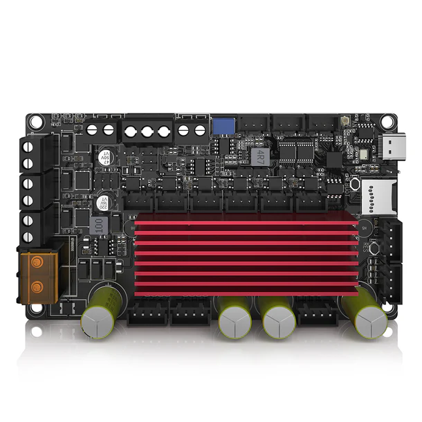

Once I arrived home, as I already had the controller, I searched for a laser, and after quite a bit of searching, I went with a Diode Laser, as it was the most affordable option and it could cut wood and acrylic, which is what I wanted to cut. I found this [laser](https://es.aliexpress.com/item/1005003306807390.html) on aliexpres, it was quite pricey (for the budget I have), but it's the best one I could find with that specs. It has a 10W output, which is enough to cut 5mm wood and acrylic, and it has a square head, which will be helpful for the mounting bracket.

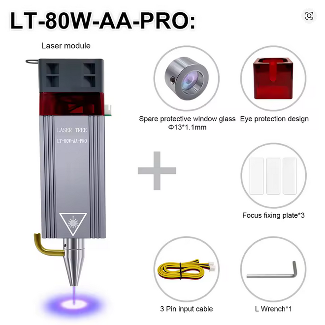

After that, I started looking for the structure I wanted to do. I planned in the sketches I'd use 2020 aluminum extrusions, so I started looking for them. I first checked aliexpress, but they were quite expensive, so I searched for other suppliers, and found JLCMC, a subsidiary of JLCPCB, which is a PCB manufacturer. They had a really good price for the extrusions, so I started using them for the structural materials. 
I ended up with:
- 1x 2020x540mm extrusion, as I wanted to have 20mm of space on each side - X axis.
- 2x 2040x440mm extrusions, as I wanted to have 20mm of space on each side too, and 2040 would help the the machine be more rigid and taller. - 2x Y axis.

Then, I started looking for the linear rails, and did quite a bit of research, but it was getting late, so I decided to leave it for the next day.

PS: sorry for not having images of the sketches

**Total time spent: 8h**

# June 19th: More components and starting the design
Today was the first day of summer holidays, so I had all day to work on the project.
First, I continued looking for the linear rails. I didn't know which ones to choose, as I have never used them before, so I had to do research (the best part of all projects). As I was looking for them in JLCMC, there were quite a few options, but I ended up with the BMW9C-1-L500-Z1-C-E20 linear rails. They weren't too expensive, and had the characteristics I wanted, so I went with them. I got 1x 500mm rail for the X axis, and 2x 400mm rails for the Y axis.

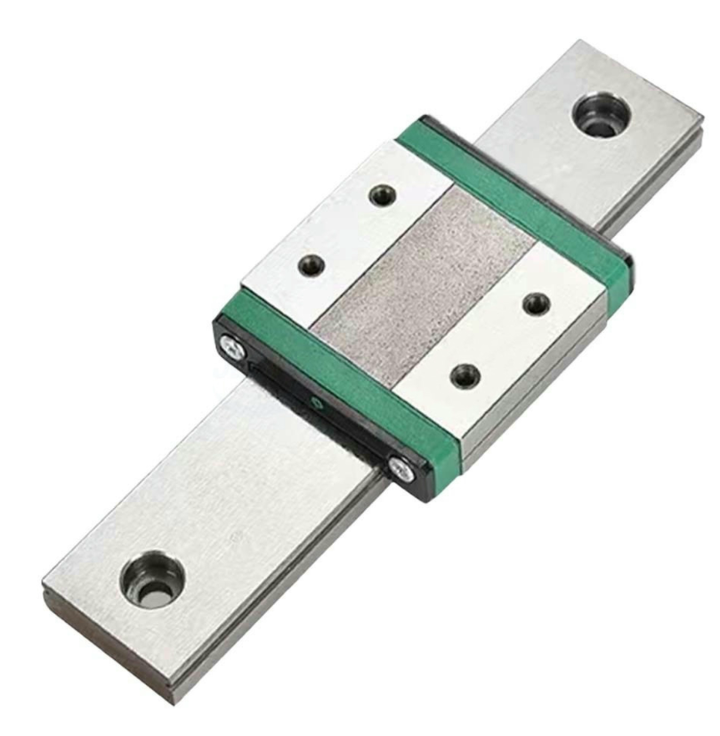

And now the last component I needed (for the base structure) was the ball screws. I thought they would be cheap (that's why I wanted to use them), but they were quite more expensive than I expected. So I thought for quite long, other ways I could use to move the axes, and ended up using GT2 belts. They are not as rigid as the ball screws, but they are way cheaper and easier to find.

After having the basic parts, I started designing the base of the frame in FreeCAD.
I started creating a template for the 2020 extrusions so I could easily create new ones of any size.

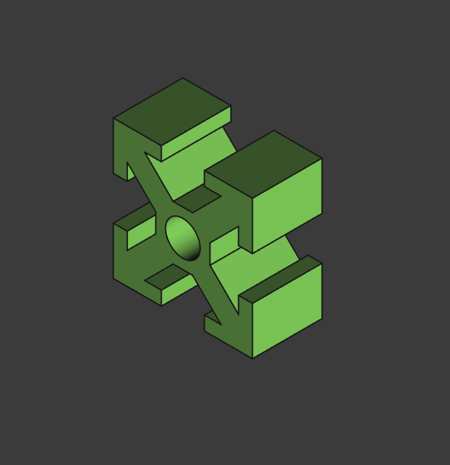

I did the same for the linear rails. I also searched for a 3d model of the Rodent controller, which was quite hard, but I finally found it.

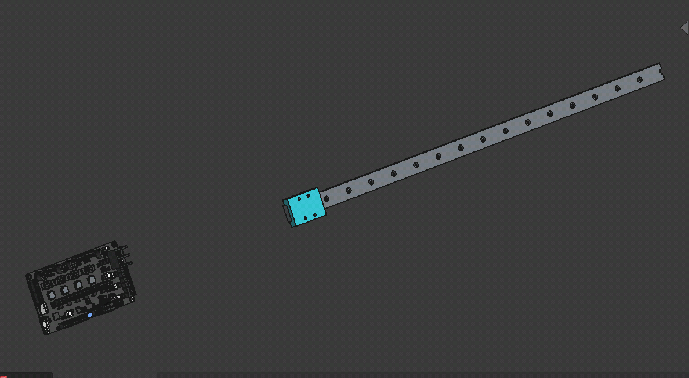

After that, I started creating the base frame. First, I did the X axis, which was quite easy, as it was just a 2020 extrusion with a linear rail.

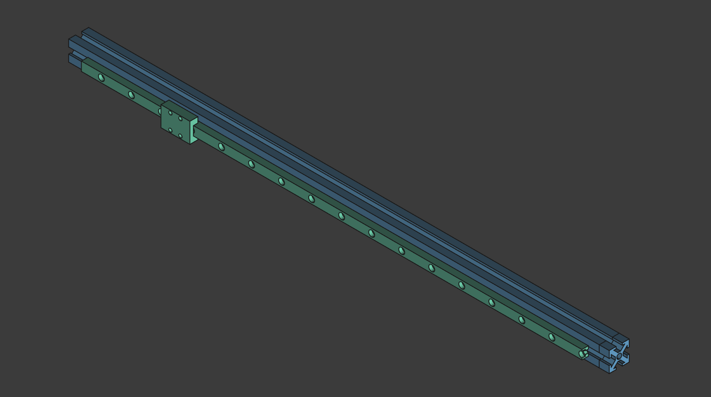

Then I did the Y axis. I had to do 2x as I wanted to have 2 Y axes, one on each side of the X axis. I used 2040 extrusions for the Y axis, as I wanted it to be more rigid and taller. I also added the linear rails to the Y axis.

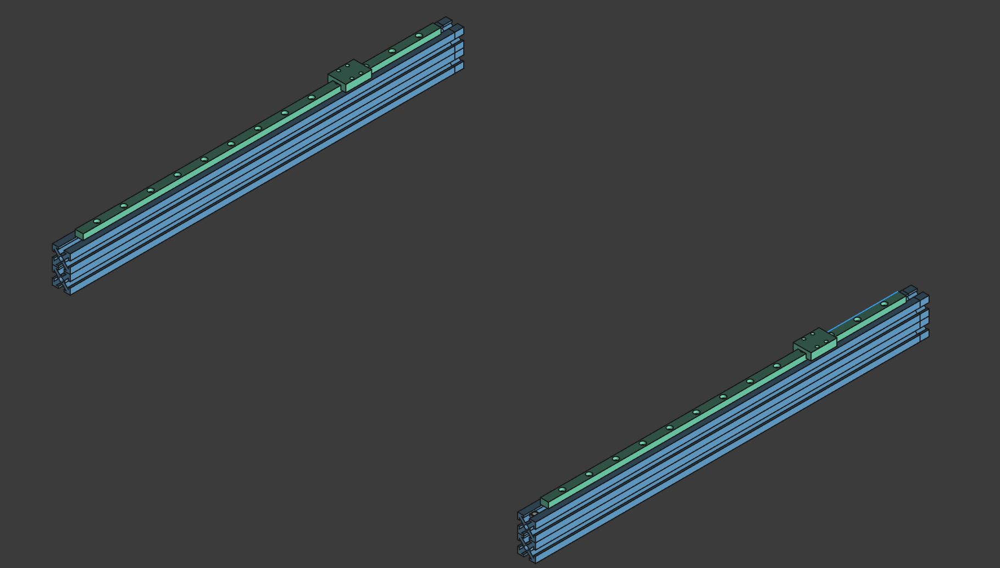

After that, I combined everything to create the base frame. I also added a rear 2020 extrusion to hold the Y axes together.

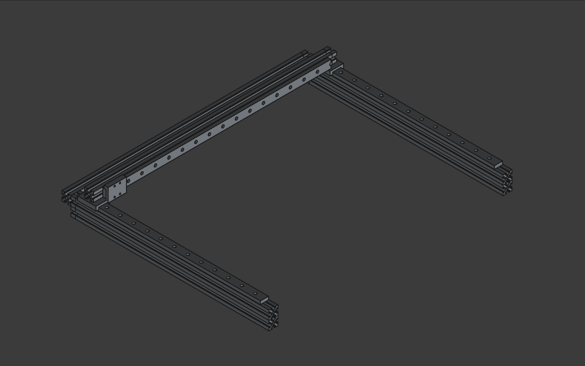

## Motors and pulleys
Now I had to find the motors I would use. I didn't know which ones to use, nor how many or where to put them, so I did some research and found that NEMA 17 motors would be the best option for this lightweight machine. What I wan't sure was about the Y motor, I wanted to use 2x motors, one on each side of the Y axis, but it seemed a bit too much, also the controller only has 1 Y stepper output. But when I realised how easier it would be to have 2x motors, I decided to use one of the remaining stepper drivers (Z) for the second motor.

Then, I searched how would the belts be mounted, but ended up leaving it for the future me, as I didn't know how to do it currently. What I did was to add the [motors](https://es.aliexpress.com/item/1005005281739306.html), [pulleys](https://es.aliexpress.com/item/32781681772.html) and [idlers](https://es.aliexpress.com/item/32817328238.html) to the model. 

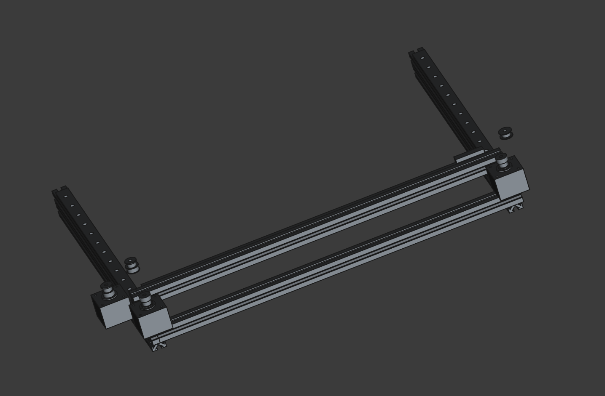

Now was time for one of the hardest parts of the project (imo, for now). The belt tensioners. I have never used nor designed them, so I had to search online what they are, how they work and maybe some example. Luckily I found a tutorial on how to tension GT2 belts on a voron 2.4, which helped me to understand how they work and how I could design one. I ended up with a a quite simple design, which I think will work. It consists of a 3d printed support for the idler, with a C-shaped piece and a 30mm M5 pin for the idler to be mounted on. The C-shaped piece has a hole with a M3 nut where a M3 screw will be used to tension the belt. I'm not sure if it will work, nor if I explained it well, but I will show you the model so you can see how it works.

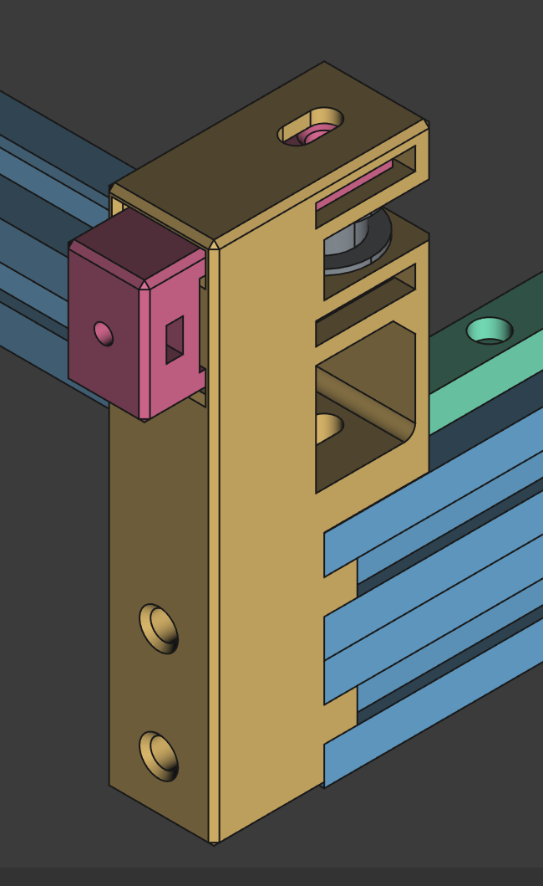

To continue, I had to find a way to mount the motors to the frame. I started with the Y motors as they seemed the easiest ones. I designed a simple bracket that would hold the motor to the 2020 extrusion. I'm not sure if it's the best way to do it, but it seems to work.

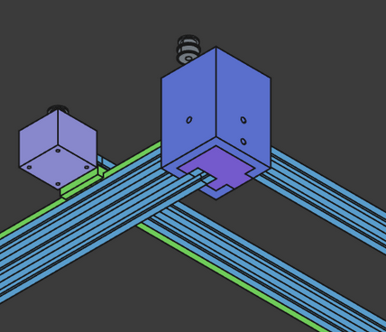

**Total time spent: 13h**

# June 20th: Continuing with the design and JLC SHIPPING!

## JLC shipping!
While designing, I checked the JLC shipping price. But what happened was unexpected, the shipping price was over 120$! This was a no-go, as I didn't have that much budget for the project, so I had to search for other supplier and ended up with the original aliexpress ones. They were a bit more expensive, specially the aluminum extrusions, but the shipping was free (and faster), so it was a way better option. The aluminum extrusions were the same, but the linear rails were a diferent model, they were MGN9C instead of BMW9C. Hope they work.

## Motors and Belts
Now I had all the tensioning components for the belts for Y axis. This is how it looks like:

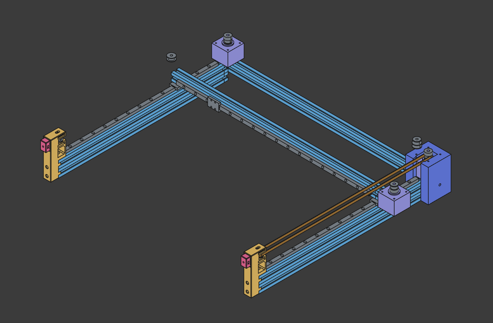

I also designed the X axis motor mount, which worked as the mount for the rail too.

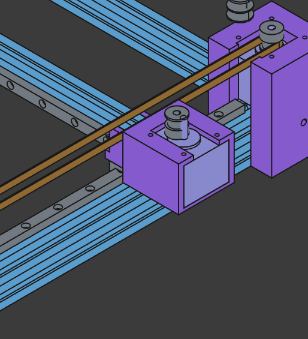

Once I had the motor mount, I started designing the X axis belt tensioner. It was quite similar to the Y axis one, but the main piece had a diferent shape, as it had to be mounted on the 2020 extrusion and it had to be used as a support for the linear rail.

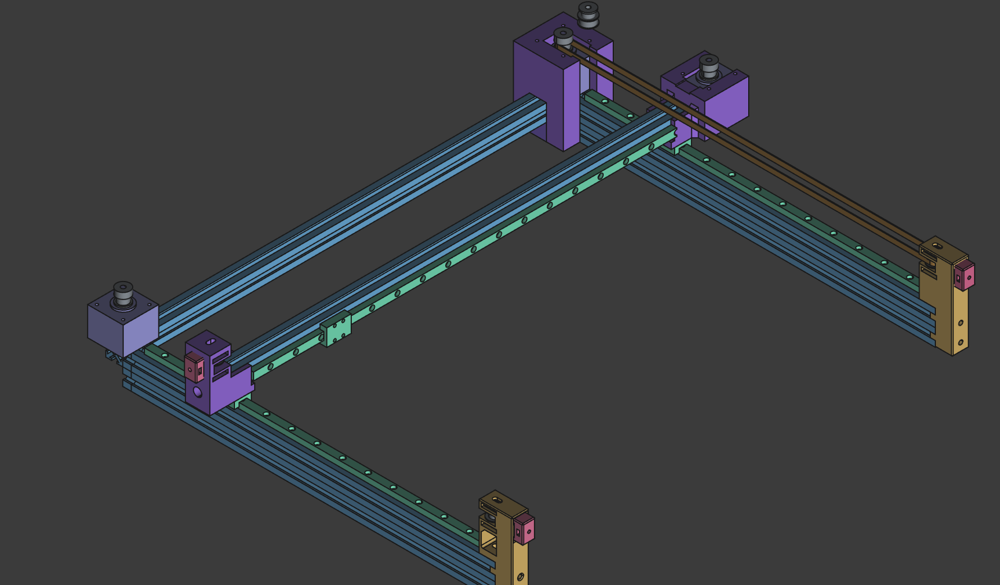

After that, I added the 2nd motor holder which was the same as the first one, but mirrored. I also added a 2020 extrusion to the front of the frame to hold the Y axis together. And to secure it I added 2020 brackets to the extrusions.
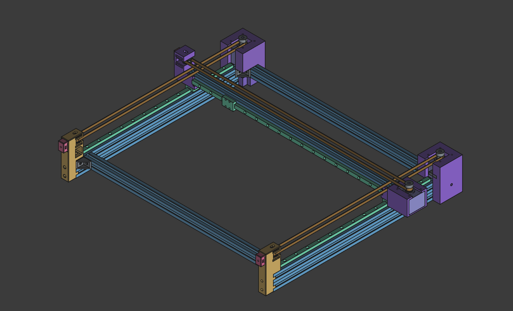

**Total time spent: 9h**

# June 21th: Aliexpress shopping
Today I didn't want to design much, so I just focused on searching for the components and trying to get the best deals I could find.

I spend all day searching for the components, and ended up with quite a good list. It was overbudget, but luckily, I got a 40€ discount coupon, so I could buy everything I needed, and still have some budget left. Sadly the coupon ends in 4 days, so I hope i get accepted before that.

[BOM](BOM.csv)

**Total time spent: 8h**

# June 22th: Laser head and coding
Today was the last day. I had to design the laser head, which was the last part of the machine.
I used the original laser head, and created a mount for it. Luckily, I found a 3d model of the laser head, so I just had to create a mount for it. I designed it to be mounted on the X axis rail, and to be able to move up and down, so I could focus the laser.

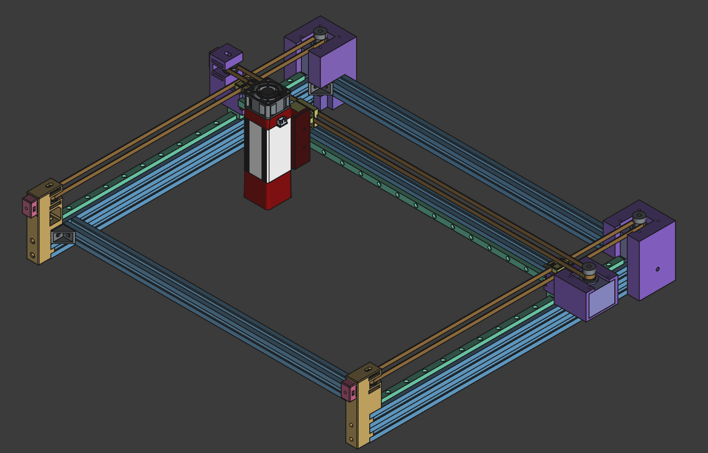

As a last thing, I added endstops to the machine, and the controller mount. The endstops were quite easy, once I found a good endstop, and the controller was quite easy too.

Final design:

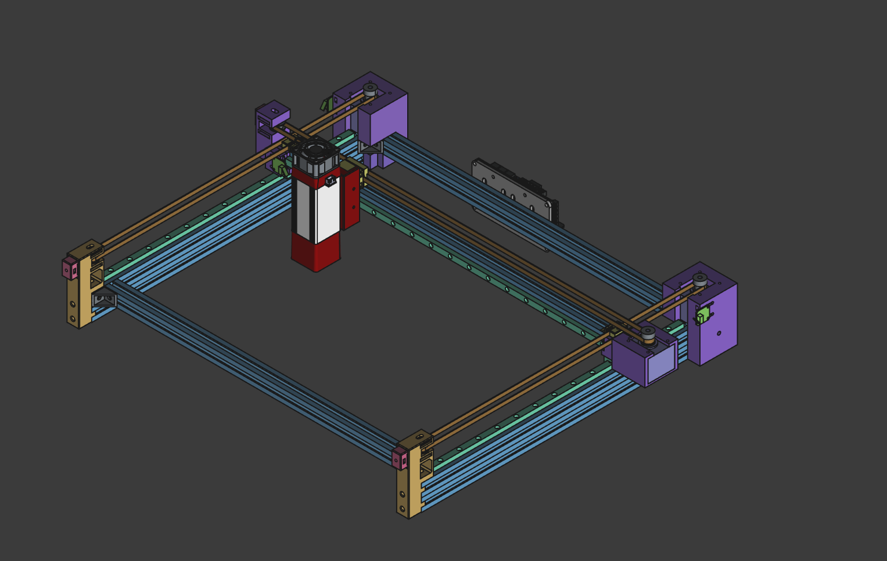

Now I only had to code the machine. I used FluidNC, and luckily, there was a template for the Rodent controller, so I just had to copy it and change a bit the configuration. eg. adding dual Y motors, enabling PWM, etc.

**Total time spent: 7h**

# July 22th: Start the build
After quite a long wait. All (almost) the pieces have arived!!
Today I started the build. First, I built the frame to see how big it would be, and to see if I had the minimum pieces to build it. I did it, but the floor was a bit uneven, so I put some wood under the legs to make it flatter. 
Then I realized I had to cut the 2020 extrusions, as they were too long, so I cut them to about the right size using a hacksaw.

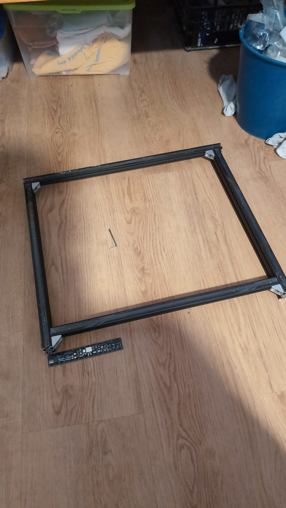

After that, I grabbed all the printed parts I had, and started removing the supports. That took quite a while, as I had used auto-generated supports, which were quite hard to remove. But I finally got them all removed.

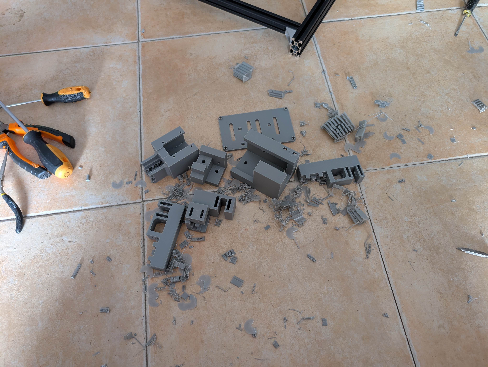

To continue, I placed the motor in the printed case, and I had to modify it a bit, as I hadn't thought about the motor connector, so I had to cut a bit of the case to make it fit. After that, I placed the motor in the case and it fit snugly.

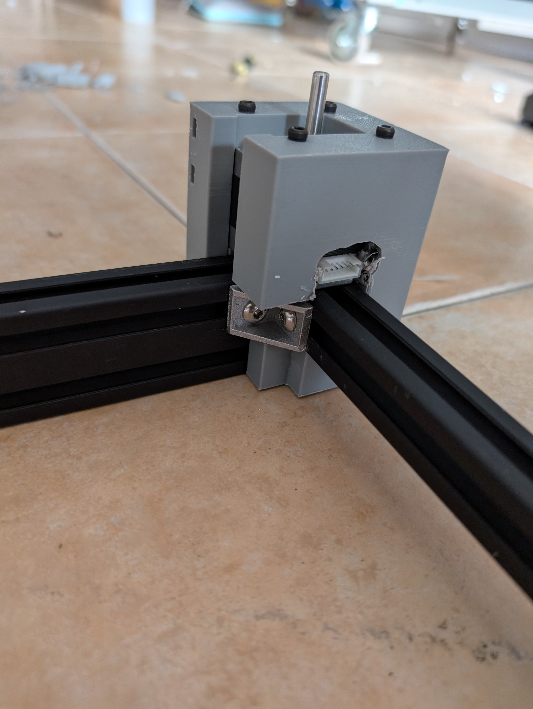

Then I placed both Y idler supports, which fit snugly too. 

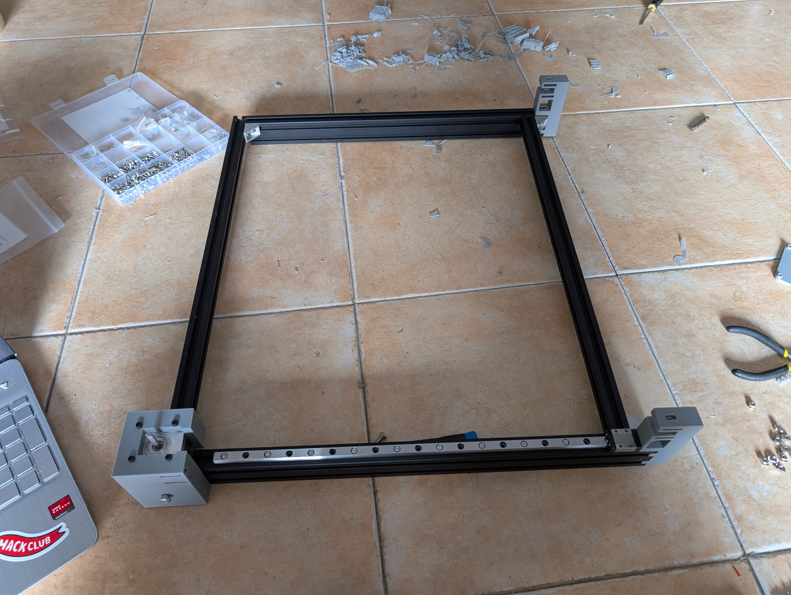

After that, I screwed both Y linear rails to the extrusions. I also added the idlers to the supports, which they weren't correctly designed, as the idlers couldn't be tensioned.

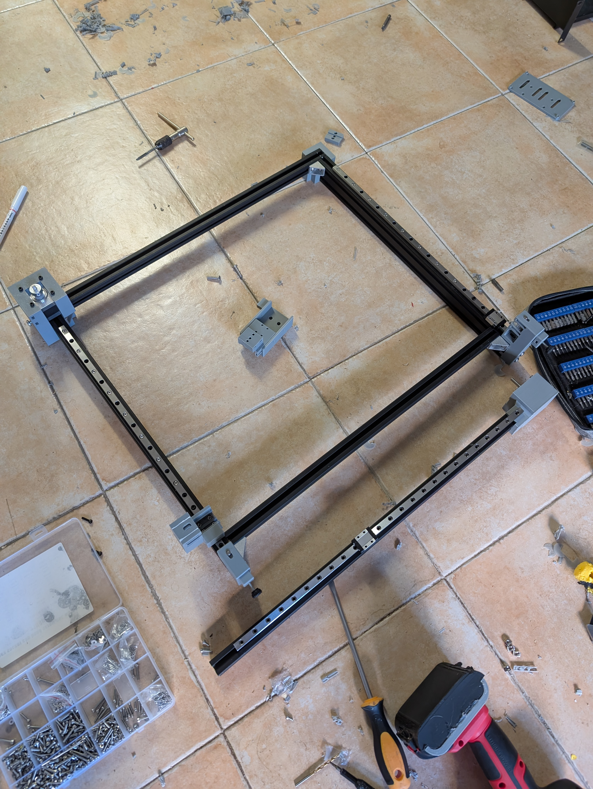

To fix: motor holders and idler supports.

**Total time spent: 6h**

# July 23th: Continuing the build
Today I continued the build. All the fixed and remaining prints finished printing.
First, I placed the 2nd motor, which I already had printed, so I had to modify it too.

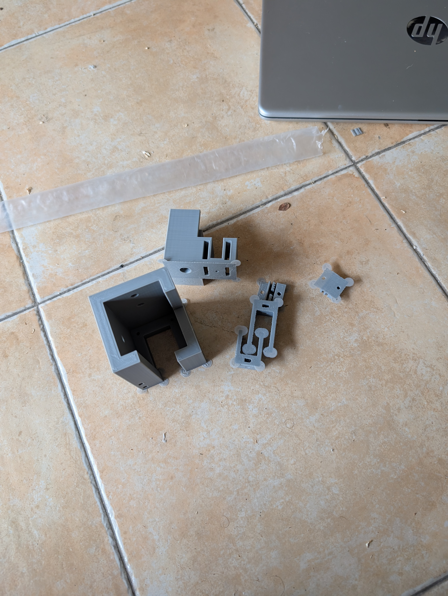

Then, I screwed the X linear rail to the X axis extrusion, and aligned it with the printed pieces. 

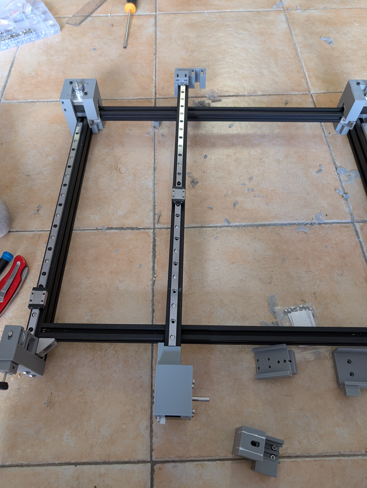

Afterwards, I realised that the X axis would be hard to place, as the extrusion was on top of the screw holes. So I had to remove the printed parts from the X extrusion, remove the linear blocks from the rails and screw them to the printed parts. I used a holder-thingy to hold the balls from the linear blocks, so they wouldn't fall out. Then I slowly placed the linear blocks on the rails. This was a tense moment, as I didn't want to lose any balls, but luckily it worked and I could mount the X axis!

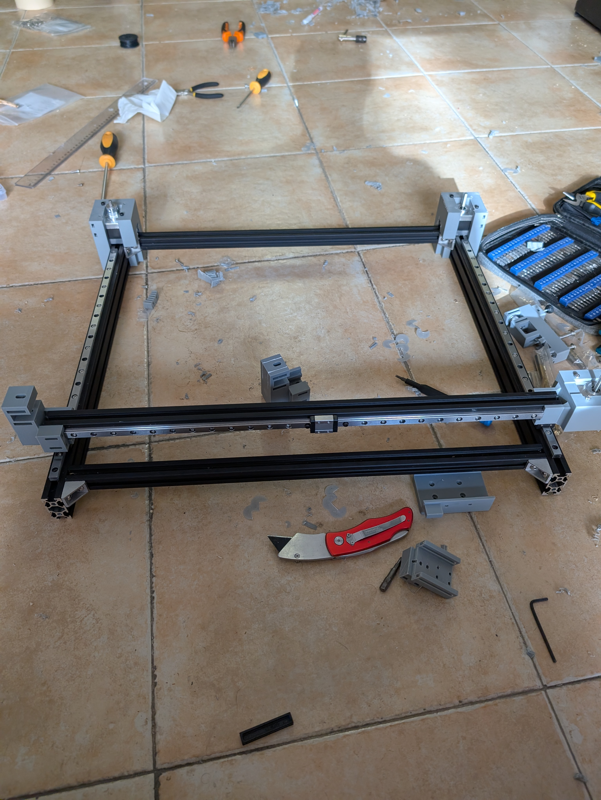

To finish, I placed the new idler supports, which were designed to be able to fit the idlers and to be tensioned. I also placed the new X idler mount, which also had a design error.

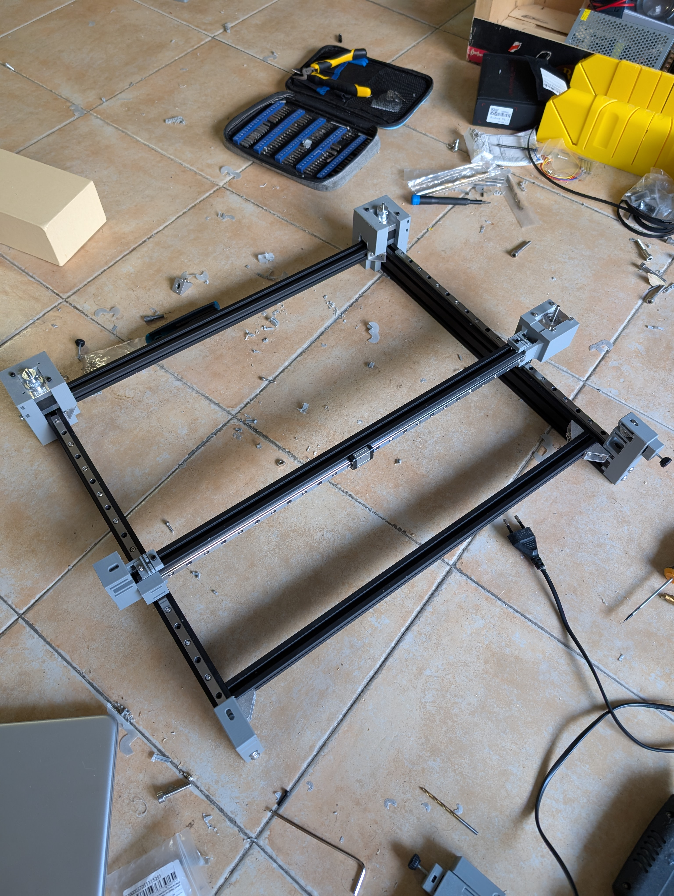

PS: I also noticed the screws I needed to use M6 screws for the extrusions, not M5, so I went and bought some M6 screws, as I didn't have any, and the next day I'll screw them to the extrusions.

**Total time spent: 5h**

# July 24th: Tapping is my passion 😭
First, I fixed the belt tensioners, as the nut was too loose and it spun freely, as I didn't use a square nut, so I just used hot glue to hold it in place. I also added a M2.5 washer to the M3 screw end, so it wouldn't damage the plastic when tightening it (it did before). 

Today I spent a LOT of time tapping the extrusions (I spent +3.5h tapping), but it was worth it. I had to tap all the extrusions, and drill some passthrough holes for some screws. I used a M6 tap, and also had to drill the printed parts to fit the M6 screws.

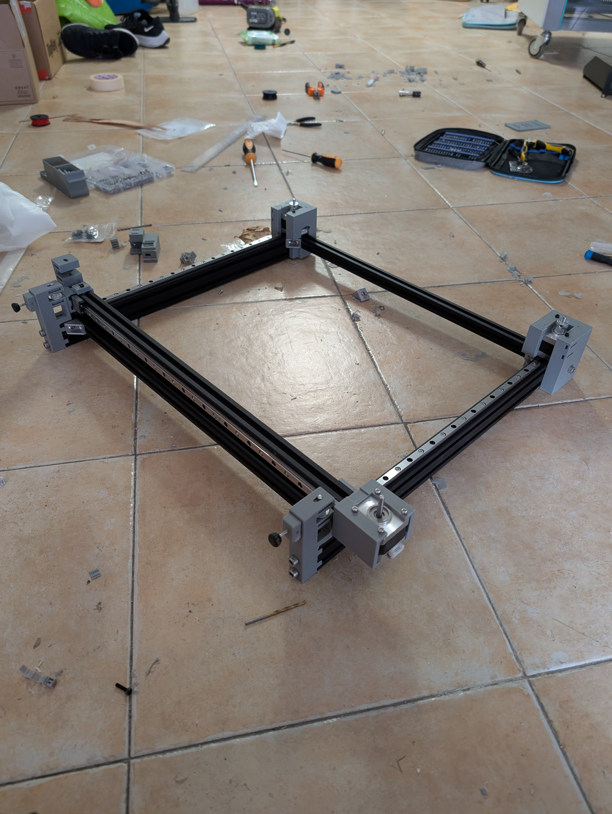

I made another mistake, one of the rear motor screw wasn't long enough, so I had to spin fast the screw so it melted the plastic and could screw to the extrusion. 

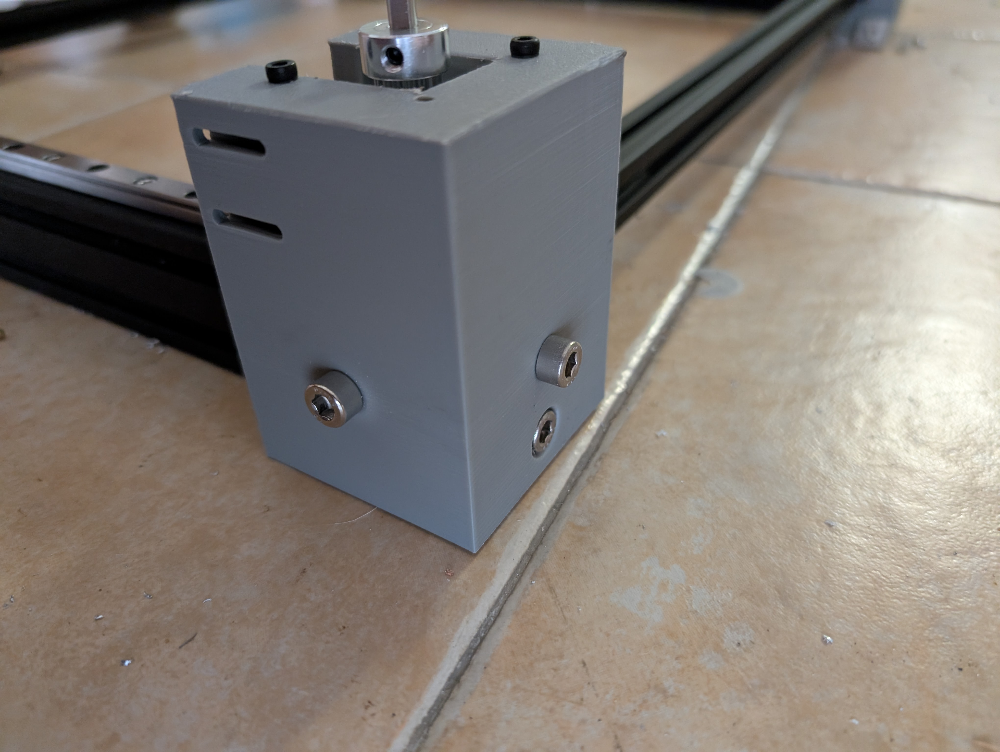

But overall, I think it turned out quite well.

I also mounted the Laser on the X axis, which was quite easy, except for the fact that I had to drill new holes to the laser support, as I had designed it wrong. Was an easy fix, though.

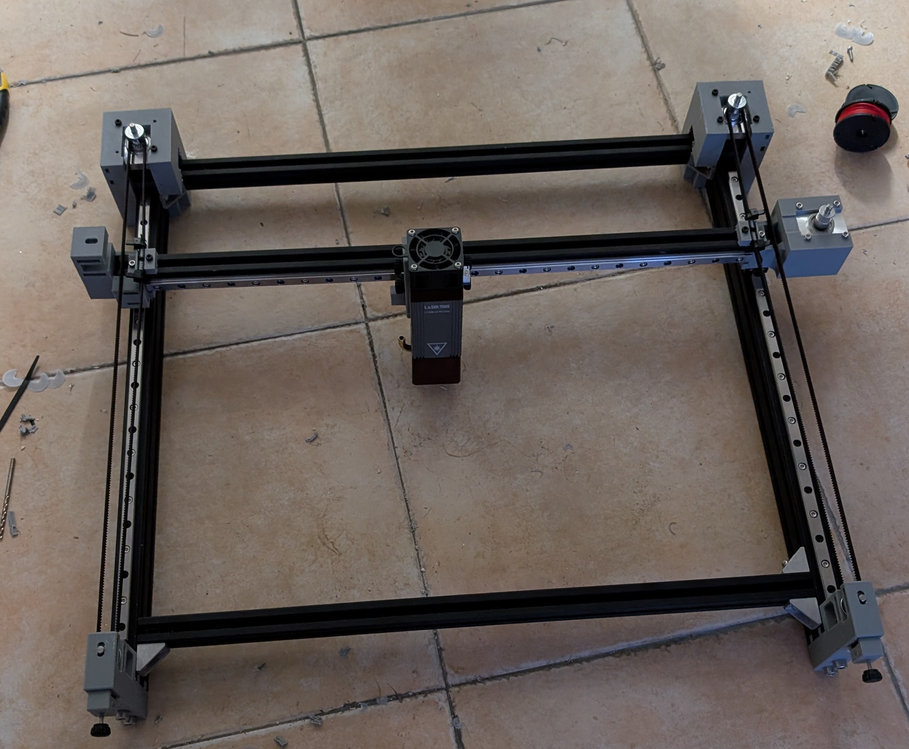

Also, while I was at it, I wanted to connect the laser belt, but I realised I had only ordered 2 pulleys and idlers for the printer, and I needed another one, so I ordered them online, and to skip the wait, I tried getting them from an old printer I had, but sadly they were too small, so I just had to wait for them to arrive.

.jpg>)

**Total time spent: 7h**

# July 25th: Electronics and wiring
Today I mounted the electronics to the frame, and started wiring everything.
first, I mounted the controller (BTT Rodent) to the frame, which was quite easy, as I just had to screw it to the frame using T-nuts. I also mounted the power supply, which was a bit harder, as I wanted it to be mounted using t-nuts too, but there weren't any holes. So I just dissasembled the PSU and replaced drilled two nuts of the PSU and replaced the screws with longer ones so I could screw it to the frame.

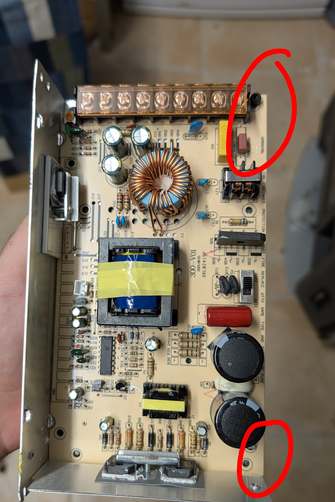

I also wired the controller and power supply, I only needed to wire the laser, and motors.

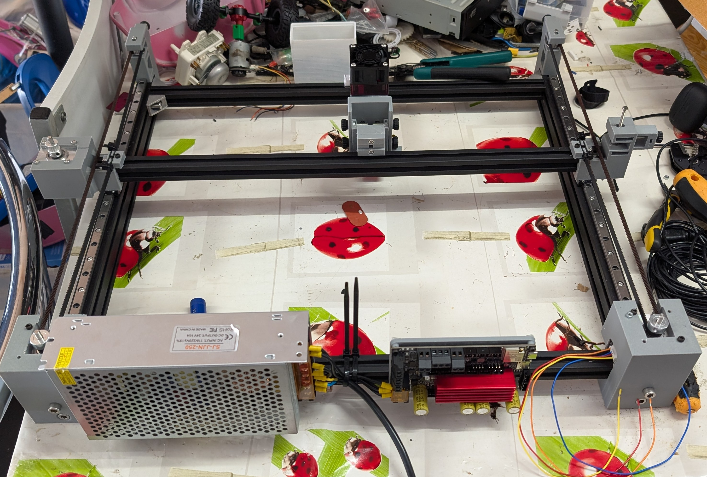

**Total time spent: 5.5h**

# July 26th: Wiring the Y motors
Today I wired and configured both Y motors, which was quite easy. Sadly, I didn't have a crimper in hand, nor the right connector, so I just used pin receptacles soldered to the stepper wires. First, I thought I had configured something wrong, (maybe too little current), so I increased the current to 3A, twice the motor current, but it still didn't work, it just vibrated. Then I had connected a motor phase in reverse, so I just swapped the wires, and it worked! Then I played with them a bit, and also used the laser for the first time, which was quite fun. While doing that, I realised the motors were quite hot, and I didn't remember why. But while reviewing the config, I saw the 3A current 😅 , so I reduced it to the recommended 1.5A, and it worked perfectly.

<video controls src="assets/build/PXL_20250726_225948615~2.mp4" title="Title"></video>

**Total time spent: 3h**

# July 27th: Wiring the X motor and belt
Today the pulleys and idlers arrived! So I could wire the X motor and belt. I first mounted the idler, which was quite easy, except for a design flaw, which made the belt tensioner almost unusable. Then I mounted the pulley to the motor, which was quite easier, as I just had to use a M3 setscrew to hold it in place.
Then, I mounted the belt to the X axis, which was a quite hard to tension, but luckily I was able to do it using zipties.

After that, I crimped the wires to the motors, wired and configured them.
Then, I did some calibrations to the laser, like, the power and speed, speed and passes, accuracy, and my favourite, the shake test.

.jpg>)

.jpg>)

.jpg>)

.jpg>)

<video controls src="assets/build/PXL_20250728_212713560.LS (1)-1.mp4" title="Title"></video>

While doing the tests, I fixed the config, and finally I did my first real ~~print~~ cut. It was for my robotics team, and it was a success!!, quite fast too. I did with cardboard, and then with wood.

.jpg>)

**Total time spent: 7h**

# July 28th: Final configuration and 3d engraving!
Today I finished the configuration of the laser, and also wanted to test something I saw online. 3D engraving. To do it, I tested with the HackClub logo, which I had to convert to a grayscale image, and then to gcode using LaserGRBL. The result, after quite a few tries, was quite good.

First try:

.jpg>)

Second try:

.jpg>)

Second try after cleaning:

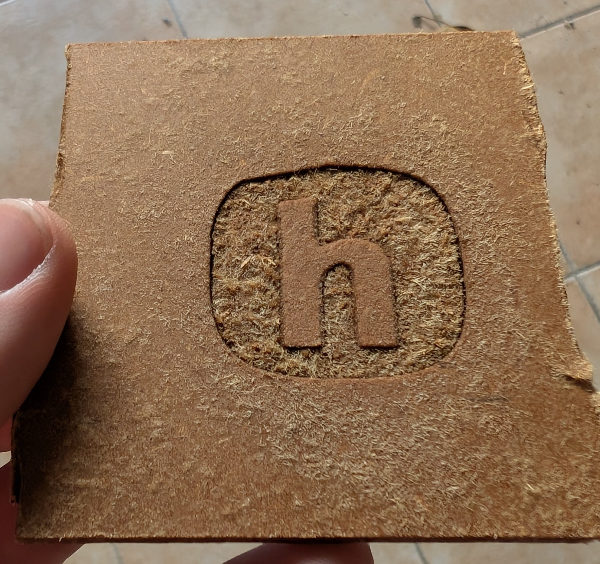

**Total time spent: 4.5h**

